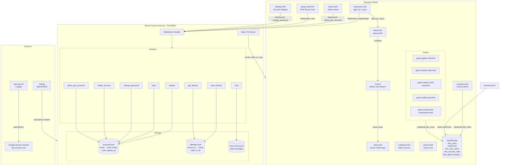

# EFM Architecture

## Pages

| Page | Purpose |
|------|---------|
| `index.html` | Home page — EFM logo, nav buttons, Let's Get Started |
| `characters.html` | Sign up / Log in form (cover page) |
| `about.html` | About EFM — shown after sign up |
| `hi.html` | Name entry — first name + last initial |
| `notebook.html` | Math lessons (chapters) |
| `games.html` | Game hub — buy and launch games |
| `inventory.html` | Coins, tickets, purchased items |
| `admin.html` | Admin panel — view all accounts (owner only) |
| `settings.html` | Account settings, password change |
| `group-chat.html` | Live group chat via WebSocket |

## Games

| Game | Coins on Win | Coins on Loss |
|------|-------------|---------------|
| Golden Trail | +100,000 | −100 (time up or quit) |
| Meteor Math | varies | varies |
| Meteor Math Easy | varies | varies |
| Bubble Pop | +10 | −5 |
| Exponential Mountaineer | varies | varies |

## Server

`cursor-server.py` runs on port 8080 and handles both:
- **HTTP** — serves all static files
- **WebSocket** — accounts, chat, cursors, identity
